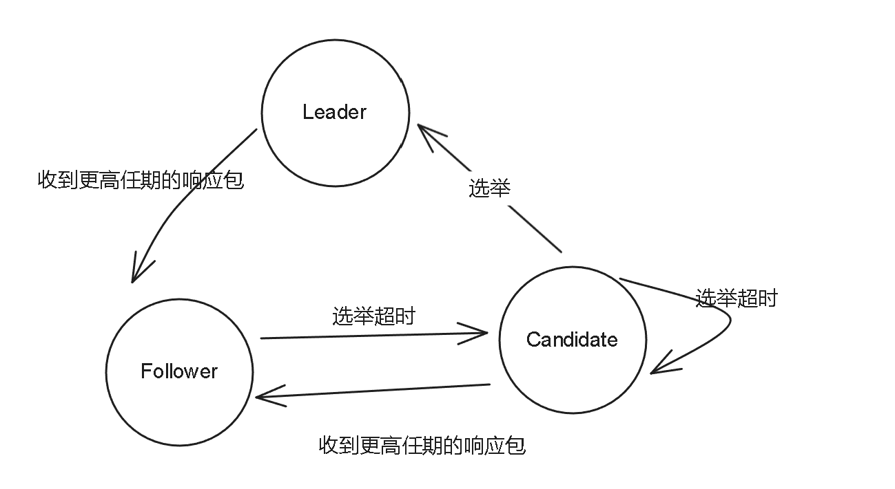

# KVStore

## 项目架构

逻辑上可以分为接入层和数据层

接入层对外提供HTTP接口访问。

数据层实现数据的管理，保证数据的一致性。

## 接入层

### API文档

|操作|Method|URL|Body|
| ------------| --------| ----------------| ---------------|
|存放键值对|PUT|/put?key={key}|字符串的Value|
|取出键值对|GET|/get?key={key}|无|
|删除键值对|DELETE|/del?key={key}|无|

**访问非Leader节点的http接口会如何？**

节点会在内部维护的集群中的LeaderId，如果访问的节点角色不是Leader，会通过RPC访问Leader获得对应的结果并返回。最多重试三次。

## 数据层

### 键值对数据是如何被存储的

Server对象使用Map存储字符串形式的键值对数据。

### 请求的执行流程是什么？

客户端发送修改请求到http服务 -> 封装为raft日志请求 -> 访问Leader节点 -> Leader节点保存日志并复制给集群中的所有节点 -> 集群中大多数节点复制成功，Leader节点发送提交通知，返回响应给客户端 -> 节点收到提交通知，提交日志(执行日志中的操作)

### 如何保证数据的一致性？

本项目使用到raft算法保证数据的一致性。

### Raft算法是什么？

Raft算法是一种分布式共识算法，目的是确保分布式系统中的节点维保持数据一致性。

首先在时间上划分为一个个任期，每个任期开始都是Leader的选举，如果选举失败，任期会因为没有Leader而结束，如果选举成功，那么Leader将负责管理整个集群，并将客户端请求封装成日志同步给所有的Follower，并在大部分Follower同步后通知集群提交数据。因此我们只需要维护日志的一致性就可以保证数据的一致性。

因此我们可以将raft划分为Leader选举、日志同步、日志压缩、成员变更这四部分。

### Raft节点的角色划分

Leader：接收客户端请求，封装成日志同步给大多数节点后提交。

Follower：接收Leader的日志同步请求，作为数据备份。

Candidate：只有在选举Leader时出现，是一个过渡状态负责选举相关操作。

## 成员变更

### Leader选举

### 选举如何实现

选举是通过选举计时器驱动的，除Leader节点外，其他角色在初始化时会启动一个一定范围内随机时长的选举计时器。Leader节点在同步日志时(同时也是心跳包，不存在日志操作时会发送空日志包作为心跳包)更新其他节点的超时时间。如果在超时时间内没有收到Leader的日志包则认为Leader丢失，发起选举。

### 什么时候会选举Leader？

* 集群刚启动时，所有节点为Follwer角色，集群中不存在Leader节点。
* 当Leader挂掉后，选举超时时钟最先跑完的Follower发起选举操作。
* Candidate选举超时也会触发重新选举。

### 选举流程

**拉票逻辑**

首先发起选举的节点会将任期+1，转换角色为Candidate并投票给自己。然后启动新的选举超时计时器。(旧计时器会因为任期变化而被释放)。

对其他节点发送拉票请求。

发送的信息包含自己的数据状态：自己的ID+任期+日志索引+提交进度。

**其他节点处理拉票请求的逻辑**

拉票方任期更低，则返回当前任期号和投反对票的响应包。(帮助对方更快的转换节点角色为Follower)

拉票方任期更高，当前节点会转Follower角色，更新投票状态。继续往下比较日志新旧状态。(成为Follower后双方任期相同)

双方任期相同，则判断自己是否已经投票给其他节点，如果是则投反对票。

如果未投票则比较日志的任期和下标，任期优先级大于下标。如果拉票方日志更新则投赞同票，反之投反对票。

将投票后的内存状态持久化到存储中避免丢失。

**拉票结果统计逻辑**

如果返回包中的任期更大，则说明当前选举节点落后，直接转为Follower节点，等待日志同步。

如果大多数节点投反对票，并且节点仍然是Candidate状态则表示当前选举失败，选举流程结束。等待选举超时后开启新一轮的选举或新Leader节点同步的日志包。

如果大多数节点投赞同票则表示当前节点成功当选Leader。转为Leader节点后立即同步一次心跳告知集群，新Leader选出。

## 日志同步

### 触发发送日志的条件

* 定时器触发。每隔固定时间间隔自动发送，也是维护心跳的保障。
* 使用channel通知日志发送模块发送数据。当有新的请求日志产生或提交请求产生时，会通过channel通知发送日志。

### 日志同步的流程？

Leader接收到客户端请求后封装成日志。

Leader节点会维护其他节点的复制进度，通过复制进度决定采用增量同步还是全量同步。

通过对应的同步方式发送日志数据给Follower节点。

Follower节点同步完毕后返回复制进度作为Leader维护复制进度的依据。Leader节点会在大多数节点同步完毕后通过心跳发送提交通知。告知集群中的节点提交日志。提交日志后节点会更新提交进度，并执行日志中的操作更新应用进度。

### 如何判断增量同步还是全量同步？

读取对应节点的复制进度和下一个发送的下标。如果在当前Leader节点的日志中存在，则表示增量复制即可完成同步任务，如果不存在则需要进行全量复制。

### 增量复制

**Leader发送逻辑**

增量复制根据节点的复制进度和请求的下一个下标，我们可以在当前维护的raft日志中截取出这部分增量日志信息。

附加上当前任期+节点提交进度+Follower节点上一次同步的日志信息，发送给Follower节点。

**Follower处理逻辑**

比较当前节点与Leader节点的任期，确保双方同一个任期内操作。

验证上一次日志同步的数据信息是否符合：

符合则从上一次同步进度开始寻找与增量日志不同的下标，从不同处开始复制。(这里在覆盖之前未提交的无效数据)。

复制成功后更新复制进度，返回同步成功。

不符合则存在冲突，根据服务端提供的上一次复制进度，在当前Follower节点维护的日志中向前寻找，尝试找到这段任期的开始下标，加入响应包中。这里以一个任期的粒度尝试纠错。Leader节点会使用这些冲突信息更新复制进度，尝试在下一次同步时给对日志数据。

### 全量复制

**Leader发送逻辑**

读取快照数据，加上Leader节点的所有日志，提交进度等信息发送给Follower节点。

**Follower处理逻辑**

使用Leader发送的全量同步数据覆盖当前的数据。返回同步成功。

Leader节点会统计同步成功的节点数量，超出总节点数一半时会发送提交通知。节点会更新提交进度，并将日志数据应用到状态机中更新键值对数据。并把这些内存信息持久化到磁盘中。

### 同步失败如何保证日志一致性

数据同步失败存在两种可能，一种是日志丢失，另一种的存在日志冲突。

#### 日志丢失

**如何判断日志丢失**：

Leader节点在日志同步时会发送它维护的本次当前节点应当从哪个索引开始复制数据 (对应PrevLogIndex)。

当这个索引的位置>=当前节点的日志长度时表明 [日志长度, PrevLogIndex] 这一段索引日志丢失了。

如何处理：

当前节点将冲突任期置为-1，表示并不是数据冲突，而是数据丢失，并且讲冲突索引置为当前日志长度。

这些信息返回给Leader后，Leader通过冲突任期为-1得知存在数据丢失，将 下一次发送索引 (`nextIndex`) 置为冲突索引(`ConflictIndex`  在这里就是等待同步节点的日志长度)， 那么下一次发送时从这个索引开始发送日志，正好能衔接上。

#### 日志冲突

**如何判断日志冲突**：

从Leader节点接收到的参数中 上一次同步索引任期与当前日志对应索引任期不符，则说明日志数据不同，存在冲突。

因为Leader的数据最新最全，所以同步日志是以Leader节点的数据为主。那么接下来只需要解决如何定位到问题数据的源头。

当前索引的任期就是冲突任期 (`ConfilictTerm`), 然后在日志中从后向前寻找，找到属于这个任期数据的第一条索引，赋值给冲突索引返回给Leader。

Leader节点通过冲突任期>=0得知存在日志冲突，那么从后往前在自己的日志中寻找到任期不为这个冲突任期的索引。

如果存在则表示最新日志的任期即存在冲突的任期，将本任期的第一位索引作为下一次赋值的位置。

下一次同步日志时会将整个冲突任期及往后的数据发送过去，接收方会通过双指针的方法找到需要同步的位置进行同步 (在如何处理同步日志请求中已说明)，从而保证日志的一致性。

如果不存在则表示最新的日志任期与同步的任期不同，这个节点的数据有点过于旧了，那么直接使用返回的冲突索引作为下一次的发送索引即可。

由于给的冲突索引是冲突任期的开始位置，作为下一次开始拷贝的位置将完全覆盖掉冲突的任期前Leader节点，以次保证日志的一致性。

## 日志压缩

#### 为什么要压缩日志？

随着系统运行，日志请求会不断堆积，导致系统性能下降，甚至内存溢出。

因此我们可以将数据进行持久化，并把持久化部分的日志删除，达到压缩日志的目的。

#### 如何触发日志压缩？

在raft节点成功处理写操作后会读取持久化文件的大小。如果文件超出设置的大小则触发日志压缩。

记录当前的运行时数据，包括任期，提交进度等信息封装为运行时数据对象，将存储键值对的MAP封装成数据快照对象，一并持久化到磁盘中。维护的日志则删除从头到提交进度的下标处，并预留首个日志位作为持久化的标记。

